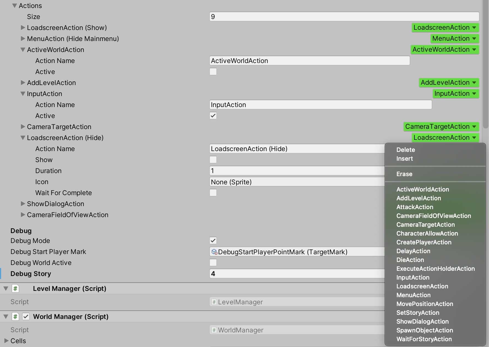

# Unity SerializeReference Property Drawer

Convenient property drawer for fields marked with the SerializeReference attribute.

You can specify a base type or a list of types. Including the interface.
Allows you to modify the array, list and single element. Displays the current field type.

Support Unity 2019.3, 2020.1 alpha.

Use for free.
Enjoy!
